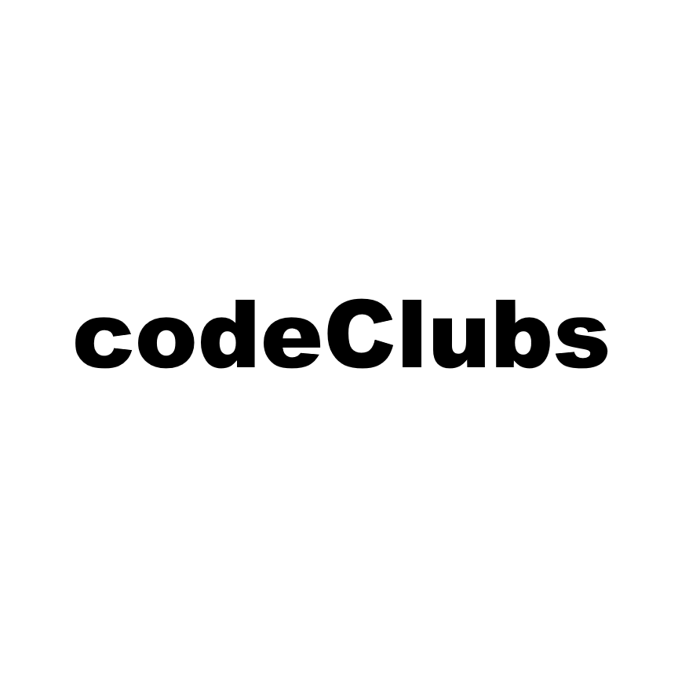
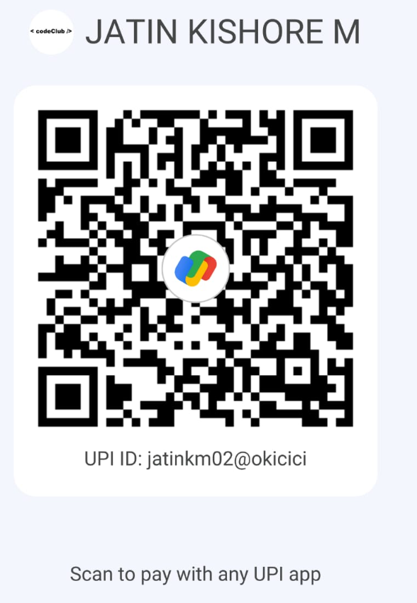

# PLACEMENT PREPARATION 
 

## FREE BEST MATERIALS 
### Complete Resource Materials
- [All Company interview Qutions](https://drive.google.com/drive/folders/1NC5wLHUMUye5_5zHzSgTgXDUdVmh43ZU)
- [Complete ACCENTURE Materials](https://drive.google.com/drive/folders/1oMtiEzBmKhDloSHmbujvB9LV0WtJ0VQq?usp=drive_link)
- [Complete TCS Materials](https://drive.google.com/drive/folders/1I8QqnzZonRewbSnUMyfC9-tRduEJ4gyB)
- [Complete ZOHO Materials](https://drive.google.com/drive/folders/1EtXkhhxviVc_orwQk78wAwav-cut63Yr)

### What is this repository for

- This repository is made to share materials to crack placement process of several companies.
- You can fork this repository and add materials that you find helpful for your fellow developers/ students to crack interviews.
- This repo will be often updated with materials from ourside and open free resource materials avaible on internet to give the users a seemless experience while preparing for job interviews and campus drives.
- For some companies we have inluded the step by step process to crack. On our "How to crack series" you can use that as well .
- All this initiation is a part of codeClubs community and its volunteers. You can join our free students community codeClubs via our official website codesclubs.in

### Request

- A common humble request for all users, This repo is nothing infront of the study materials what you have in hand. My friend if you have some time, just fork this repo and add some materials for your fellow developers/students.
- If you have any queries contact me in personal via linkedln - [Jatin Kishore M](www.linkedin.com/in/jatinkishore-m)
- 'Star'⭐ the repo. This can motivate us to 'commit' more materials into the repo.
=======
# USER GUIDE

You can find 3 folders in this repository. The following sections guide you on how to use each directory.

## 1. HOW TO CRACK

- This folder contains several subfolders with study materials and complete explanations for cracking interviews, along with video explanations for specific companies discussed in our HOW TO CRACK SERIES.
- The ["How to Crack"](https://youtube.com/playlist?list=PLz-zAvuE-NlSJUj-XajNoLg8Vem1NrAq2&feature=shared) series is a YouTube playlist by [code clubs](https://youtube.com/@codeclubs), disclosing a step-by-step process to crack respective companies with round-wise discussions and important topics to study and crack the interview.

## 2. INTERVIEW EXPERIENCES

- This folder contains "Interview Experiences" from real-time employees and individuals who have attended interviews at certain companies, as requested by codeClub members.
- [codeClub](https://chat.whatsapp.com/IWa8mKJ4RGE27RbqQy4XRg) is a student WhatsApp group where we discuss placement preparation, student awareness, conduct knowledge-sharing sessions, and more. codeClub is part of our [codeClubs](https://chat.whatsapp.com/JvBdfwhvguqDqIzL0KdSfZ) student community.

## 3. PRICELESS PREPARATION MATERIALS

- This folder contains free preparation materials sourced from various places.
- It includes a file named "Complete Resource Materials," where you can find comprehensive resources to crack the given companies that are hard to find individually. It is advised to go through that file first.

---

### What is this repository for

- This repository is made to share materials to crack the placement process of several companies.
- You can fork this repository and add materials that you find helpful for your fellow developers/students to crack interviews.
- This repo will be frequently updated with materials from our side and open free resource materials available on the internet to provide users with a seamless experience while preparing for job interviews and campus drives.

### A Humble Request

- A humble request to all users: This repo is nothing compared to the study materials you have in hand. If you have some time, please fork this repo and add some materials for your fellow developers/students.
- If you have any queries, contact me personally via LinkedIn - [Jatin Kishore M](https://www.linkedin.com/in/jatinkishore-m).
- 'Star' ⭐ the repo. This can motivate us to 'commit' more materials to the repo.

### codeClubs

- This initiative is part of the [codeClubs](https://chat.whatsapp.com/JvBdfwhvguqDqIzL0KdSfZ) community and its volunteers.
- You can join our free student community, codeClubs, via our official website [codeclubs.in](https://codeclubs.in).
- We also encourage students by conducting free weekly coding contests, named [fightClub](https://chat.whatsapp.com/CiFXBOUzmIy2SANVYletsQ). Every week, the winners are awarded a small cash prize and honored on our official winners page [Weekly Winner's Page](https://codeclubs.in/WeeklyWinners.html).
- Subscribe to us on [YouTube](https://youtube.com/@codeclubs).

   

### Contributions
- As a non-profit community, codeClubs has not generated any promising income to date and it is completely depends upon contributors and volunteers. Even a ₹1 from you can motivate us to do something more.
- If you wish to support our work, you can contribute via our UPI ID: jatinkm02@oksbi / below QR code. Please mention your name and share a few words with us when making a contribution, so we can include you on our contributors list on our webpage. Thank you for considering and supporting our efforts.

  

### Volunteers & Contributors
- codeClubs is running over 2 years and in this huge time period, we have gone thourgh huge volunterial activites in our community and those volunteers and as a community its our responsibilty to recognize our Volunteers and Contributors. Therefore we made separate document to address them.
- [Domain Contributors](https://domain-contributions.netlify.app/)
- [Volunteers & Contributors](https://docs.google.com/document/d/12Qcw9UTajmg_Xee4iKPRFegVz_kNecbcMbjhfG7LTsg/edit?usp=sharing)

